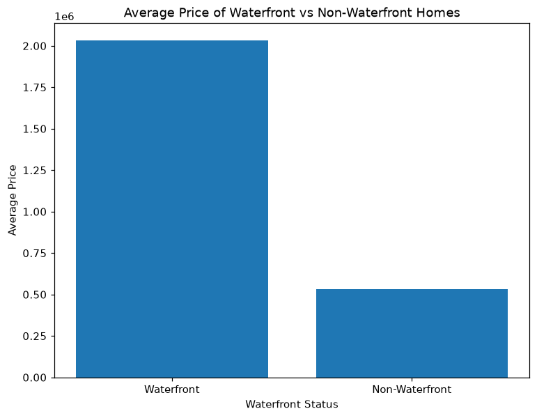
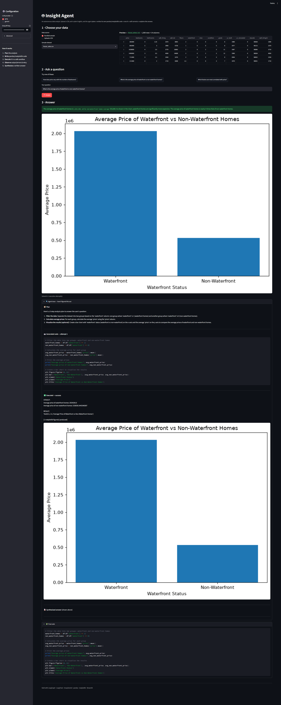
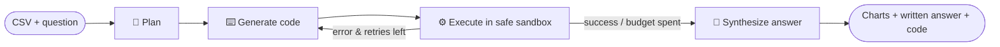

# 🤖 Insight Agent — Autonomous Data Analyst

> Upload any CSV, ask a question in plain English, and an LLM **agent** plans the
> analysis, **writes its own pandas/matplotlib code, runs it, reads the result (or
> the error), self-corrects, and hands back charts + a written answer + the code.**
> It's "an AI that does data science" — built on **LangGraph**.

<p align="center">
  
  
  
  
  
  
</p>

<p align="center">
  <a href="https://insight-agent-gg7xztjsawotlkcrselyqs.streamlit.app/"></a>
</p>

<p align="center">
  
  <br><em>A chart the Insight Agent wrote and ran itself — average price of waterfront vs non-waterfront homes.</em>
</p>

---

## 🎯 Overview

Most "chat-with-your-data" demos just translate a question into one SQL/pandas call.
The **Insight Agent** is different: it's a true **agent loop** that *reasons, writes
code, executes it, observes the outcome, and fixes its own mistakes* — the way a human
analyst iterates in a notebook.

Give it a CSV and a question like *"Do fiber-optic customers churn more than DSL?"* and it will:

1. **Plan** the analysis in plain language.
2. **Write** the pandas/matplotlib code to carry it out.
3. **Execute** that code in a locked-down sandbox.
4. **Observe** the printed output, the returned value, any figures — or the traceback.
5. **Self-correct**: if the code errored, it feeds the traceback back to itself and tries again (bounded retries).
6. **Synthesize** a concise, business-readable answer that cites the real numbers, alongside the chart and the exact code it ran.

## 🎬 Demo

<p align="center">
  
</p>

<p align="center"><em>Answering “What is the average price of waterfront vs non-waterfront homes?” end-to-end: the agent planned the analysis, wrote and ran its own pandas/matplotlib code, drew the chart, and explained the result (waterfront homes average ~$2.03M vs ~$534k — about 4× higher). The expanded trace shows the exact code it wrote.</em></p>

## ✨ Features

- 🧠 **Agentic reasoning with LangGraph** — an explicit `plan → gen_code → execute → observe → (retry) → synthesize` state machine, not a single prompt.
- 🔧 **Writes & runs its own code** — real pandas/matplotlib, executed live against your data.
- ♻️ **Self-correcting** — reads its own tracebacks and repairs the code (configurable retry budget).
- 🔒 **Safe executor** — AST allow-list, restricted builtins, headless matplotlib, and an execution timeout (see below).
- 🔌 **Pluggable LLM** — Groq (default, free) or Gemini, switchable by a dropdown / env var.
- 📊 **Transparent** — the UI shows the full trace: the plan, every code attempt, each execution result, and the final answer.
- 🧪 **Tested offline** — the whole graph is verified with a stub LLM, no API key or network required.

## 🧠 How it works



The shared **state** carried between nodes is:
`{question, df, schema, plan, code, observation, last_error, n_tries, max_tries, figures, answer, steps}`.
The conditional edge after `execute` is the heart of the agent: on failure (with retries
left) it routes back to `gen_code` with the traceback attached; otherwise it proceeds to `synthesize`.

## 🔒 Safe code execution

Letting an LLM run code demands care. The executor (`insight_agent/executor.py`) uses defence in depth:

| Layer | What it does |
|---|---|
| **Static AST check** | Parses the code and **rejects** disallowed imports (only `pandas, numpy, matplotlib, scipy, …`), banned calls (`open, eval, exec, __import__, getattr, …`), and dunder access (`__globals__`, `__class__`-walks) **before** anything runs. |
| **Restricted namespace** | Runs with a curated `__builtins__` whitelist and only `df, pd, np, plt` in scope. |
| **Headless backend** | Forces matplotlib `Agg` — thread-safe, no display, figures captured to PNG. |
| **Timeout** | Executes in a worker thread and abandons runs that exceed the limit. |
| **Defensive copy** | The agent gets `df.copy()`, so it can't corrupt your data across turns. |

> This is appropriate for a **trusted, single-user** analyst tool. For untrusted/multi-tenant
> use, wrap it in OS-level isolation (container + seccomp).

## 🗂️ Project structure

```
Ankit_Saxena_Insight_Agent/
├── insight_agent/
│   ├── __init__.py
│   ├── state.py        # AgentState (the LangGraph blackboard)
│   ├── llm.py          # provider factory: Groq (default) / Gemini, lazy imports
│   ├── prompts.py      # planner / coder / synthesizer prompts + schema summariser
│   ├── executor.py     # the safe Python executor (AST allow-list + sandbox)
│   └── graph.py        # the LangGraph state machine + run_agent()
├── app/
│   └── app.py          # Streamlit UI (upload/sample → ask → live trace → answer)
├── tests/
│   └── test_offline.py # offline stub-LLM tests (no key/network)
├── data/samples/       # bundled demo CSVs (Walmart, Telco churn, house sales)
├── assets/             # screenshots / example output
├── reports/            # technical report (.docx / .pdf)
├── requirements.txt    # LEAN runtime deps
├── requirements-optional.txt  # Gemini provider (optional)
├── requirements-dev.txt       # pytest
├── .env.example
├── STEPS.md
└── LICENSE
```

## 🚀 Quickstart

```bash
git clone https://github.com/AnkitSaxena-AI/insight-agent.git
cd insight-agent
python -m venv .venv && source .venv/bin/activate   # Windows: .venv\Scripts\activate
pip install -r requirements.txt

cp .env.example .env        # then paste your free Groq key into .env
streamlit run app/app.py
```

Get a free Groq key (no card) at <https://console.groq.com/keys>. Full steps in **[STEPS.md](STEPS.md)**.

## 🧪 Tests (offline, no key)

```bash
pip install -r requirements-dev.txt
pytest -q
```

The suite stubs the LLM and asserts the executor runs code & captures a figure, blocks
dangerous code, reports errors as text, and — the headline test — drives the **full
LangGraph agent** through a forced error so it must **self-correct** before answering.

## 📊 Bundled datasets & example questions

| Sample | Try asking |
|---|---|
| `walmart_sales.csv` | *Which store has the highest average weekly sales?* · *Holiday vs non-holiday sales?* |
| `telco_churn.csv` | *What's the churn rate by contract type?* · *Do fiber-optic customers churn more than DSL?* |
| `house_sales.csv` | *How does price vary with bedrooms?* · *Average price of waterfront vs non-waterfront homes?* |

…or upload your own CSV.

## 🧰 Tech stack

**LangGraph** · **LangChain** · **Groq (Llama 3.3 70B)** / **Gemini** · **pandas** · **matplotlib** · **Streamlit**

## ⚠️ Notes & limitations

- The agent's quality depends on the chosen LLM; very wide/messy CSVs may need a couple of retries.
- The executor is a pragmatic sandbox, not a security boundary for untrusted users (see above).
- Free LLM tiers are rate-limited; heavy use may need a paid tier.

## 📄 License

MIT © 2026 Ankit Saxena
